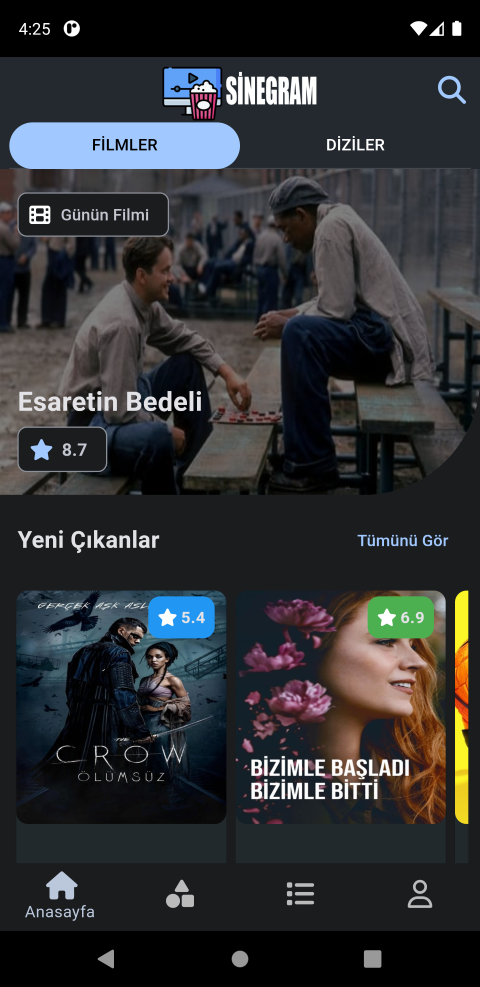

Sinegram 
A Movie/Series App with Flutter 

Features: 
:heavy_check_mark: At home page , user sees classified movies and series like the popular,top rated,upcoming etc. 
 
:heavy_check_mark: When user clicks on movie or series card its navigate to details screen,at there user sees a image of movie/series,rating points,categories,minute of movie,episode and seasons numbers,overview,actors,provider platforms,production companies etc. . 
 
:heavy_check_mark: Movies and series are categorized, them displayed according to the relevant category clicked on the categories screen. 
 
:heavy_check_mark: User can add to favorite any movie or series and create lists with the name she/he wants.  
 
:heavy_check_mark: User can log in and register with firebase authentication feature. 
 
:heavy_check_mark: User can search on movies and series. 
 
:heavy_check_mark: Firebase used for backend and database operations. 
 
:heavy_check_mark: TMDB API used for movies and series data. 

Technologies: 
:pushpin: Flutter 
:pushpin: Dart 
:pushpin: Firebase Authentication 
:pushpin: Firebase Database 
:pushpin: TMDB API 
:pushpin: MVVM Architecture 
:pushpin: Important Packages : firebase_core,firebase_auth,firebase_storage,http 

Home Screen 
 
 
 
 
Categories Screen 
 
 
Details Screen 
 
 
 
 
Login - Register Screen 
 
 
Lists Screen 
 
 
 
Search Screen 
 
Menu Screen 
 

This project developed by [YusufUguz](https://github.com/YusufUguz) 
